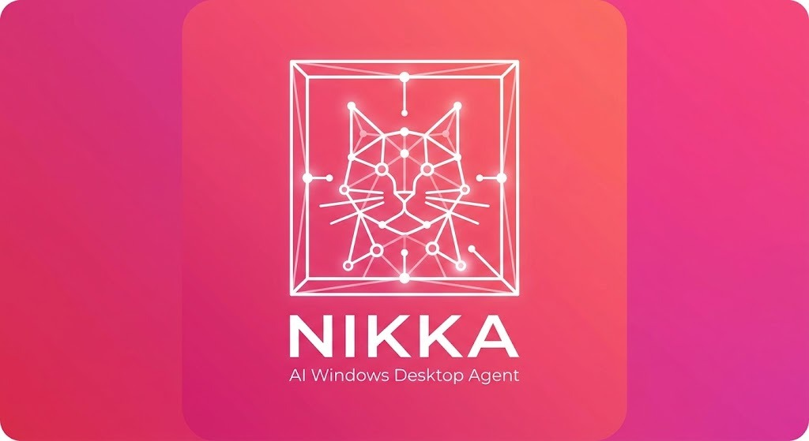

<div align="center">
  
</div>

# Nikka 🤖

> **AI Desktop Agent for Windows OS Automation via Local LLMs**  
> Created for & by **Anas Amchaar**

Nikka is a production-grade, low-context AI desktop assistant designed to run on Windows PCs powered by local LLMs (e.g., Gemma 3 12B / 4B via LM Studio) without requiring heavy vision models.

---

## Key Features

- **Anti-Hallucination UI Abstraction**: Traverses the Windows UI Automation (UIA) tree via `pywinauto`, filters to interactive controls, and maps sequential integer IDs (e.g. `[ID: 1] Button: 'Save'`) to coordinates in internal memory. The LLM only reasons over IDs — never pixel coordinates.
- **Universal Multi-Modal Capabilities**:
  - **Native Windows Apps**: UI tree inspection (`get_screen_context`, `click_element`, `type_text`).
  - **Electron & Media (Spotify, Discord, VS Code, Chrome)**: System hotkeys (`press_hotkey`), global media controls (`media_control`), direct URI running (`open_uri_or_path`), and instant clipboard pasting (`paste_text`).
  - **Creative Suites & Canvas (Photoshop, Paint, Blender, CAD)**: Tool shortcuts (`press_key`), canvas drawing & brush strokes (`mouse_drag`), coordinate clicking (`mouse_click`), and mouse scrolling (`mouse_scroll`).
  - **Window & Workspace Management**: Window focus (`focus_window`), maximize/minimize/close, and virtual desktop migration (`switch_virtual_desktop`, `move_window_to_desktop`).
- **Full Spotify Integration** (18 tools): Search & play, queue, playlists, mood-based discovery, playback controls, device management, and library operations — all via the Spotify Web API with UI-automation fallback.
- **smolagents `CodeAgent` Integration**: High tool-calling precision using executable Python action steps.
- **Dynamic Tool Registry**: Auto-discovers any tool in `nikka.tools` without manual wiring.
- **Typed Pydantic Configuration**: Configure via `nikka/settings.py`, `.env` file, or CLI flags.
- **Physical Failsafe**: Integrated `pyautogui.FAILSAFE` — move mouse to screen corner to abort actions.

---

## Project Structure

```
Nikka/
├── pyproject.toml              # Modern Python packaging & dependencies
├── README.md                   # Documentation
├── .env.example                # Environment variables template
├── tests/                      # Unit & integration tests
│   ├── __init__.py
│   ├── test_tools.py           # Core tool discovery & settings tests
│   └── test_spotify.py         # Spotify integration tests
└── nikka/                      # Main package
    ├── __init__.py             # Version metadata
    ├── __main__.py             # python -m nikka entry point
    ├── settings.py             # Pydantic Settings with .env support
    ├── exceptions.py           # Custom exception hierarchy
    ├── logging.py              # Centralized logging
    ├── agent.py                # CodeAgent builder
    ├── cli.py                  # CLI & Interactive REPL
    ├── core/                   # UI tree traversal & coordinate mapping
    │   ├── __init__.py
    │   ├── ui_state.py         # Ephemeral ID ↔ Coordinate registry
    │   ├── ui_parser.py        # pywinauto UIA tree walker
    │   └── desktop_workspace.py # Virtual desktop management
    └── tools/                  # Extensible tool modules
        ├── __init__.py         # Public tool exports
        ├── _registry.py        # Automatic tool discovery
        ├── _spotify_client.py  # Spotify Web API client (singleton)
        ├── screen.py           # Screen inspection & ID clicking
        ├── keyboard.py         # Keyboard input
        ├── mouse.py            # Mouse clicks, dragging, scrolling
        ├── clipboard.py        # Clipboard read/write/paste
        ├── window.py           # Window focus, maximize, minimize, close
        ├── desktop.py          # Virtual desktop switching & window moving
        ├── apps.py             # Application launcher & process manager
        ├── system.py           # Hotkeys, media keys, URI opener
        ├── spotify.py          # Spotify playback, playlists, mood search
        └── security.py         # Security analysis scanner
```

---

## Installation & Setup

### 1. Clone and activate your virtual environment

```powershell
cd Nikka
uv venv .venv
.\.venv\Scripts\activate
```

### 2. Install in editable mode with development dependencies

```powershell
uv pip install -e ".[dev]"
```

### 3. Start LM Studio

- Load `google/gemma-3-12b` (or `gemma-3-4b`)
- Enable the Local Server (port `1234`)

### 4. Configure environment variables

```powershell
cp .env.example .env
```

Edit `.env` with your settings. The LM Studio defaults work out of the box — see the sections below for optional integrations.

### 5. Launch Nikka

```powershell
nikka
# or
python -m nikka
```

---

## Spotify Setup (Optional)

Nikka includes **18 Spotify tools** for full playback control, playlist management, mood-based discovery, and more. These require a free Spotify Developer account.

> **Note**: Playback control tools (play, pause, skip, volume) require **Spotify Premium**. Search, playlists, and library tools work with free accounts.

### Getting your Spotify API Credentials

1. **Go to** the [Spotify Developer Dashboard](https://developer.spotify.com/dashboard)
2. **Log in** with your Spotify account (free or Premium)
3. **Click "Create App"** and fill in:
   - **App name**: `Nikka` (or anything you like)
   - **App description**: anything
   - **Redirect URI**: `http://127.0.0.1:8888/callback`
   - **Which APIs?**: check **Web API**
4. **Click "Save"**
5. On your app page, click **"Settings"**
6. Copy your **Client ID** (visible on the page)
7. Click **"View client secret"** and copy the **Client Secret**

### Add credentials to `.env`

```env
NIKKA_SPOTIFY_CLIENT_ID=your_client_id_here
NIKKA_SPOTIFY_CLIENT_SECRET=your_client_secret_here
NIKKA_SPOTIFY_REDIRECT_URI=http://127.0.0.1:8888/callback
```

### First-time authorization

The first time you use a Spotify tool, Nikka will open your browser asking you to authorize the app. Click **"Agree"** — after that, the OAuth token auto-refreshes and you won't be prompted again.

### Available Spotify Tools

| Tool | Description |
|------|-------------|
| `spotify_search_and_play(song_name)` | Search and play a song immediately |
| `spotify_add_to_queue(song_name)` | Add a song to the queue |
| `spotify_play_songs_in_order(songs)` | Play a list of songs in sequence |
| `spotify_toggle_shuffle(enable)` | Enable/disable shuffle |
| `spotify_get_current_track()` | Get current track info & progress |
| `spotify_pause()` | Pause playback |
| `spotify_resume()` | Resume playback |
| `spotify_skip_next()` | Skip to next track |
| `spotify_skip_previous()` | Go to previous track |
| `spotify_set_volume(percent)` | Set volume (0–100) |
| `spotify_set_repeat(mode)` | Set repeat: off / track / context |
| `spotify_seek(position_seconds)` | Seek within current track |
| `spotify_search_by_mood(mood)` | Find tracks by mood (happy, sad, chill, etc.) |
| `spotify_create_playlist(name, songs)` | Create a playlist and add songs |
| `spotify_manage_playlist(action, ...)` | List, view, add to, or remove from playlists |
| `spotify_get_devices()` | List available playback devices |
| `spotify_transfer_playback(device)` | Move playback to another device |
| `spotify_like_track(song_name)` | Save a track to your library |

**Supported moods for `spotify_search_by_mood`**: happy, sad, energetic, calm, romantic, party, focus, angry, chill, workout.

---

## Extending Nikka with New Tools

To add a new capability (e.g. file operations, clipboard, audio control):

1. Create a new file in `nikka/tools/` (e.g., `nikka/tools/clipboard.py`):
   ```python
   from smolagents import tool

   @tool
   def read_clipboard() -> str:
       """
       Read and return text currently stored in the Windows clipboard.
       """
       import pyperclip
       return pyperclip.paste()
   ```
2. That's it! `discover_tools()` automatically finds and registers any `@tool` in `nikka/tools/` on startup.

---

## Running Tests

### All tests
```powershell
pytest tests/ -v
```

### Core tests only (no Spotify API needed)
```powershell
pytest tests/test_tools.py -v
```

### Spotify integration tests
```powershell
# All Spotify tests (requires credentials in .env + Spotify desktop open)
pytest tests/test_spotify.py -v

# Non-playback tests only (won't touch your music)
pytest tests/test_spotify.py -v -k "not playback"

# Specific category
pytest tests/test_spotify.py -v -k "TestSearch"
pytest tests/test_spotify.py -v -k "TestPlaylists"
```

Tests auto-skip if Spotify credentials aren't configured. Playback tests also auto-skip if no active Spotify device is found.

